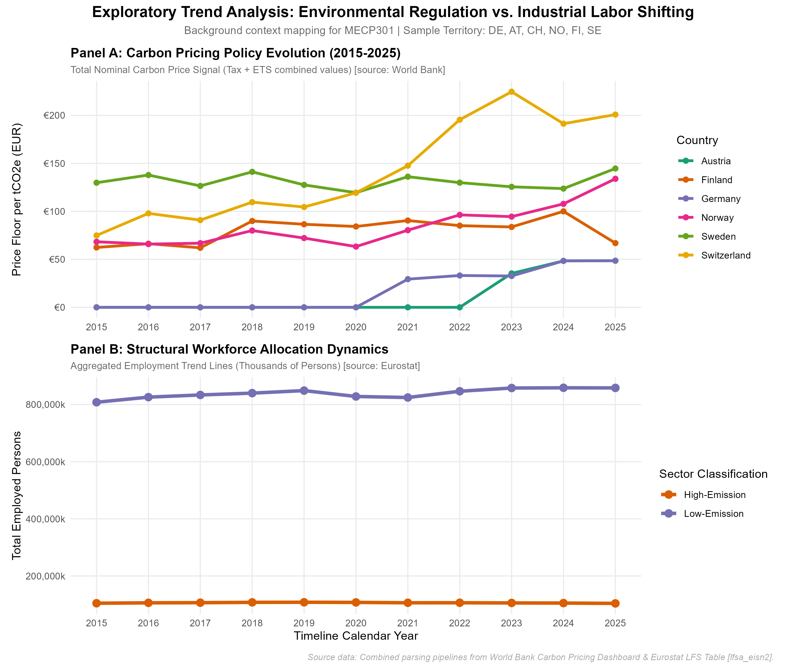

# Impact of Carbon Pricing on Intra-firm Human Capital Composition Changes (2015-2025)
### Research Project Paper Portfolio | MA Economics (IGNOU)
**Target Territory Scope:** Germany, Austria, Switzerland, Norway, Finland, Sweden

This research repository hosts an automated, reproducible data engineering pipeline that merges global environmental policy indicators with structural European labor market dynamics. The resulting balanced panel dataset is structured to evaluate how increasing stringency in carbon pricing signals alters the ratio of blue-collar to white-collar employment in the heavy-emitting industrial space.

## Structural Research Framework & Data Ingestion

### Independent Variable (Dataset A): Environmental Policy Stringency
* **Source:** World Bank Carbon Pricing Dashboard (`Compliance_Price` Series)
* **Metric:** Consolidated annual nominal carbon tax rate and Emissions Trading System (ETS) allowance floor prices converted to Euros (EUR).
* **Pipeline Logic:** The code maps localized mechanisms, handles overlapping jurisdictions (e.g., matching domestic country-level carbon taxes alongside the overarching EU ETS framework), and aggregates concurrent policy values into a single comprehensive metric: `Total_Carbon_Price_EUR`.

### Dependent Variable (Dataset B): Human Capital Skill Composition
* **Source:** Eurostat Labor Force Survey (LFS) Public Use Dataset (Table: `lfsa_eisn2`)
* **Industry Vector (NACE Rev. 2 Classification):** 
  * *High-Emission Sectors:* Manufacturing (C), Utilities (D), Transportation & Storage (H).
  * *Low-Emission Sectors:* Information & Communication Technology (J), Commercial & Public Services (G-U, excluding H).
* **Skill Vector (ISCO-08 Classification):**
  * *High-Skill / White-Collar:* Managers (OC1), Professionals (OC2), Technicians and Associate Professionals (OC3).
  * *Low-Skill / Blue-Collar:* Plant & Machine Operators/Assemblers (OC8), Elementary Occupations (OC9).

## Project Repository Environment Structure
```text
carbon-pricing-human-capital/
├── data/
│   ├── raw/         <- World Bank Excel and Eurostat LFS CSV raw data assets (Git-ignored)
│   └── processed/   <- Cleaned metrics and final master balanced panel CSV
├── notebooks/       <- Interactive Jupyter Notebook for Dataset A parsing and EDA
├── scripts/         <- Automated script processing engines
│   ├── 02_clean_eurostat_lfs.R   <- Tidyverse script parsing structural labor strings
│   ├── 03_merge_and_panel.R      <- Integration engine uniting indicators via Left Join
│   ├── 04_exploratory_visualizations.R   <- Graphics script generating dual-panel plots
│   └── 05_descriptive_statistics.R       <- Compilation script tracking summary metrics
└── README.md        <- Primary academic research documentation
```

## Econometric Specification Blueprint
The final dataset structure is prepared to fit a longitudinal Fixed Effects (FE) or Difference-in-Differences (DiD) model to evaluate intra-firm substitution elasticity:

$$\ln(\text{Employment\_Count}_{itjk}) = \beta_0 + \beta_1 (\text{Total\_Carbon\_Price}_{it} \times \text{High\_Emission}_j) + \alpha_i + \gamma_t + \epsilon_{itjk}$$

Where $i$ represents country, $t$ is year, $j$ defines sectoral emission exposure, and $k$ denotes workforce skill level.

## Data Trends Preview
Below is the automatically compiled visualization generated from the repository's direct processing engine:


